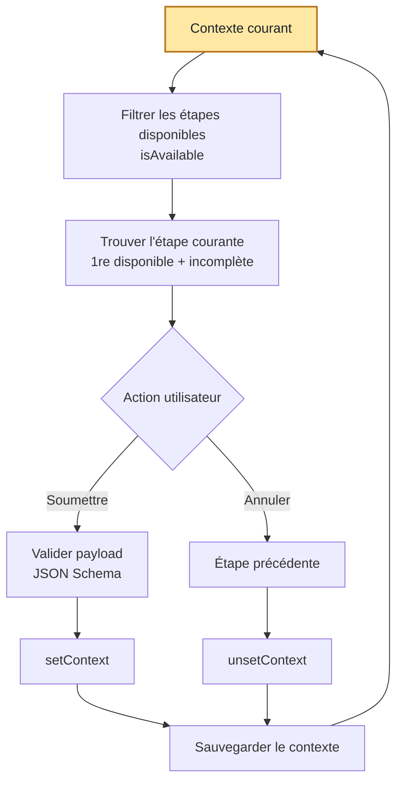

_publication initiale sur le [blog tech d'indy.fr](https://tech.indy.fr/2026/05/05/conception-d-une-fsm-maison/)_


## C'est quoi une _finite state machine (FSM)_ ?

Une FSM (ou machine à états finis 🇫🇷) est une
[modélisation informatique](https://fr.wikipedia.org/wiki/Automate_fini) qui permet, à partir d’un
ensemble d’états et de transitions, de connaître l’état courant, d’identifier la prochaine étape
possible et de mémoriser la progression, comme un GPS. On peut aussi parler de
[State Pattern](https://refactoring.guru/design-patterns/state).

## Contexte

Chez Indy, plusieurs parcours utilisateur reposent sur des formulaires, comme l’inscription ou le
paramétrage du compte. Les réponses y sont enregistrées progressivement, certaines questions peuvent
dépendre du contexte, que ce soit des données extérieures ou simplement les réponses précédentes.
L’utilisateur doit pouvoir reprendre un formulaire là où il l’avait laissé.

Historiquement, les formulaires n’avaient pas grand-chose en commun dans leur fonctionnement ou leur
implémentation.

Lors de l’ajout du formulaire de souscription client, l’objectif n’était pas seulement d’ajouter un
formulaire de plus, mais de factoriser cette logique pour pouvoir en construire, modifier et
maintenir facilement plusieurs. En modélisant le problème,
[la machine à états est vite apparue comme un pattern naturel](https://refactoring.guru/design-patterns/state).
Après tout, un formulaire de ce type n’est qu’une suite d’étapes, avec des règles de passage, un
état courant et un contexte persistant. C’est donc tout naturellement que nous avons commencé par
explorer des solutions dédiées à ce type de modélisation. Mais les librairies externes envisagées,
comme [XState](https://stately.ai/docs/xstate), ne sont pas adaptées à notre besoin, souvent peu
configurables ou parfois trop “usine à gaz”.

## Définir les specs

Le cahier des charges est simple pour permettre une adoption totale et homogénéiser le
fonctionnement des formulaires :

- facile d’ajouter / modifier / supprimer une question (évolution fréquente des formulaires)
- une question peut avoir une condition d’affichage (question précédente, élément externe)
- si on quitte le formulaire, on revient à la même question
- pouvoir revenir en arrière pour modifier une réponse

En résumé, on veut un formulaire, avec des questions (états), conditionnable (contexte), la
possibilité de quitter et de revenir (état courant), et amplement modulable.

Pour limiter le coût initial de développement et limiter au maximum la dette technique, il est aussi
défini que des fonctionnalités plus avancées, comme la mise en cache des réponses en cas de retour
en arrière, seraient déléguées au consommateur du module.

## Conceptuellement ça donne quoi ?

Notre machine à états est volontairement minimaliste : une **liste ordonnée
d’étapes** et un **contexte persistant**.

Chaque étape embarque ses propres règles. Elle sait si elle est disponible, si elle est déjà
complétée, comment enregistrer une réponse dans le contexte, comment l’annuler, et quel format de
données elle accepte. De son côté, le contexte n’a besoin que de pouvoir être lu et mis à jour.

```ts
state = {
	key,
	payloadSchema,
	isAvailable(context),
	isCompleted(context),
	setContext(context, payload),
	unsetContext(context),
};

contextStore = {
	get(),
	set(context),
};
```

À partir de là, on reste sur un fonctionnement volontairement très léger. On ne stocke pas l’étape
courante comme une vérité absolue : on la **recalcule** à partir du contexte et de la liste des
étapes :

- l’**état courant** est la première étape disponible encore incomplète ;
- l’**état précédent** est la dernière étape déjà validée ;
- si aucune étape ne reste à compléter, alors le parcours est terminé.

Lorsqu’un utilisateur interagit avec un formulaire, on suit toujours la même séquence :

```ts
context = contextStore.get()
currentState = getCurrentState(context, states)

submit(stateKey, payload):
	vérifier que stateKey == currentState.key
	valider payload avec payloadSchema
	newContext = currentState.setContext(context, payload)
	contextStore.set(newContext)
```

Ce fonctionnement apporte trois garanties : on ne peut soumettre que l’étape en cours, on ne peut
revenir en arrière que sur la dernière étape complétée, chaque donnée envoyée est validée avant
d’être enregistrée.

C’est ce qui rend l’approche intéressante : notre step machine reste générique, tandis que
l’intelligence du parcours est portée par les étapes elles-mêmes. Ajouter ou modifier un formulaire
revient alors surtout à décrire de nouvelles étapes, sans avoir à complexifier le cœur de la
machine.



## Finite _Step_ Machine : quand les étapes remplacent les états

Cette réflexion est née en rédigeant cet article : _« C’est toujours une finite state machine ? »_

Et la réponse est… non, pas vraiment !

Une **machine à états classique** modélise des **états métier** et les **transitions** qui les
relient. Chaque état y représente une situation stable du système, et chaque événement déclenche une
transition vers un nouvel état défini et prévisible.

Dans notre cas, nous ne manipulons pas des _états_ au sens strict. Nous gérons plutôt des **étapes
de parcours** qui contribuent à faire évoluer un _contexte_ dynamique, sans pour autant incarner un
« état atteignable ».

Notre implémentation s’apparente plus à un
[wizard-pattern](<https://en.wikipedia.org/wiki/Wizard_(software)>) qu’à une FSM classique. Le
moteur ne décrit pas un graphe complexe de transitions : il parcourt une **liste ordonnée
d’étapes**, en déterminant dynamiquement la suivante en fonction du contexte.

Nous nous sommes inspirés des _finite state machines_, mais pour en proposer une version **linéaire,
pragmatique et adaptée à nos besoins.** Une approche que nous aimons, avec un brin de mauvaise foi,
surnommer _finite **step** machine_ (donc bien une FSM\* 😛 !).

## Conclusion

Notre besoin était simple. Dans ce contexte, construire une FSM minimaliste en interne était plus
pertinent que d’adopter une grosse librairie, avec son coût d’apprentissage et sa complexité
d’usage.

Après deux années d’utilisation, le constat reste le même : cette *finite step machine* répond
toujours à notre besoin, s’adapte à des parcours variés, et n’a pratiquement nécessité aucune
maintenance.

> _« Même la plus petite [step] peut changer le cours de l’avenir. » Galadriel, Le Seigneur des
> anneaux : La Communauté de l’anneau_
